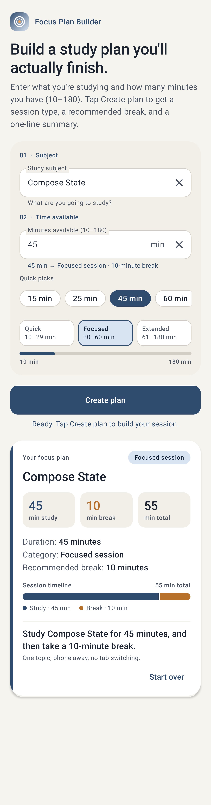
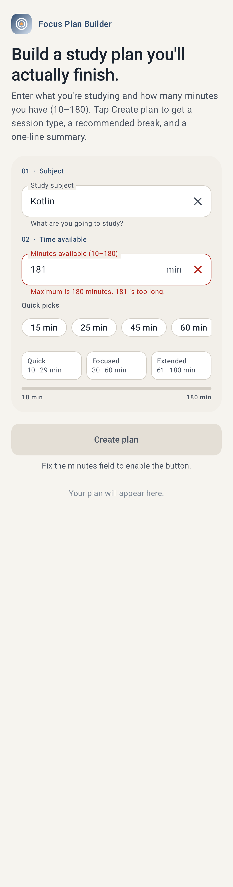

# Focus Plan Builder

**Name:** Priyanshu Singh
**BU ID:** U73441029
**Course:** CS501 E1
**Assignment:** Individual Coding Assignment 2 — Focus Plan Builder
**Package:** `com.priyanshusingh.focusplanbuilder`

---

## Table of contents

1. [Overview](#overview)
2. [Features](#features)
3. [Screenshots](#screenshots)
4. [Running the app](#running-the-app)
5. [Project structure](#project-structure)
6. [How the app works](#how-the-app-works)
7. [State and recomposition explanation](#state-and-recomposition-explanation)
8. [Validation rules and edge cases](#validation-rules-and-edge-cases)
9. [Testing](#testing)
10. [Visual design](#visual-design)
11. [Git history](#git-history)
12. [AI use](#ai-use)

---

## Overview

Focus Plan Builder is a single-screen Android app, written in Kotlin with
Jetpack Compose (Material 3), that turns a subject and an amount of free time
into a short, structured study plan.

The user types a subject and the number of minutes they have (10–180). The app
validates both fields as they type, enables the **Create plan** button only when
the input is valid, and then shows a result card containing:

- the study subject
- the session duration
- a duration category (*Quick review*, *Focused session*, or *Extended session*)
- a recommended break length (5, 10, or 15 minutes)
- a one-sentence summary, e.g.
  *"Study Compose State for 45 minutes, and then take a 10-minute break."*

There are no XML layouts, Fragments, or legacy Views: the entire UI is Compose.

---

## Features

**Required by the assignment**

- Single `MainActivity` hosting a Compose UI, Material 3 theme, min SDK 24.
- Two text inputs (subject, minutes) with a number keyboard on the minutes field.
- Null-safe parsing with `toIntOrNull()`: letters, decimals, blanks, and numbers
  too large for an `Int` can never crash the app.
- `Create plan` button enabled only when the subject is non-blank **and** the
  minutes parse to a whole number in 10..180.
- `durationCategory(minutes)` and `recommendedBreak(minutes)` implemented as
  `when` expressions in their own files.
- `FocusPlan` data class holding subject, minutes, category, and break.
- Result card rendered only when a plan exists.
- State hoisted into `FocusPlanRoute`; `FocusPlanScreen` is stateless and
  communicates through callbacks.
- `rememberSaveable` for both inputs (and the plan) so rotation preserves them.
- Editing either input after a plan is created clears the old card; a new plan
  requires another tap.

**Extra polish**

- Inline validation messages under each field that explain exactly why the
  button is disabled ("Minimum is 10 minutes. 9 is too short.").
- Live preview under the minutes field: "45 min → Focused session · 10-minute
  break" before the plan is even created.
- Quick-pick chips for common durations (15, 25, 45, 60, 90, 120).
- A duration scale that shows the three bands and where the current value falls.
- A session timeline on the card showing study time vs. break proportionally.
- A **Start over** button that clears everything.
- Result card animates in and out; category colour accent on the card.
- Light and dark theme, edge-to-edge layout, adaptive launcher icon.
- Keyboard-aware layout (`imePadding` + `adjustResize`) and vertical scrolling so
  nothing is hidden on small screens.

---

## Screenshots

| Plan created (Compose State, 45 min) | Validation error |
|---|---|
|  |  |

<<< If you add your own emulator/phone screenshot, drop it in `docs/screenshots/`
and add a column here, e.g. ``. >>>

---

## Running the app

### Requirements

| Tool | Version |
|---|---|
| Android Studio | Ladybug (2024.2) or newer |
| JDK | 17 (bundled with Android Studio as `jbr`) |
| Gradle | 8.9 (via wrapper, downloaded automatically) |
| Android Gradle Plugin | 8.7.3 |
| Kotlin | 2.0.21 |
| Compose BOM | 2024.12.01 |
| Min / target / compile SDK | 24 / 35 / 35 |

### Steps

1. Clone the repository and open the **`Assignment2-FocusPlanBuilder/`** folder
   (not the repository root) in Android Studio.
2. Let Gradle sync. The first sync downloads the Compose BOM and dependencies.
3. Start an emulator (API 24+) or connect a phone with USB debugging enabled.
4. Press **Run ▶**. `MainActivity` launches.

### Command line

```bash
./gradlew assembleDebug                 # builds app/build/outputs/apk/debug/app-debug.apk
./gradlew testDebugUnitTest             # 116 JVM unit tests
./gradlew connectedDebugAndroidTest     # 22 Compose UI tests (needs a running emulator/device)
```

On Windows, if you see `JAVA_HOME is set to an invalid directory`, point it at
Android Studio's bundled JDK, e.g.
`$env:JAVA_HOME = "C:\Program Files\Android\Android Studio\jbr"`.

---

## Project structure

```
Assignment2-FocusPlanBuilder/
├── build.gradle.kts                  # root: plugin declarations via version catalog
├── settings.gradle.kts
├── gradle/libs.versions.toml         # single source of truth for versions
├── docs/screenshots/                 # README images
└── app/
    ├── build.gradle.kts
    └── src/
        ├── main/
        │   ├── AndroidManifest.xml
        │   ├── res/                  # strings, themes, colours, adaptive launcher icon
        │   └── java/com/priyanshusingh/focusplanbuilder/
        │       ├── MainActivity.kt           # only Activity; setContent { FocusPlanRoute() }
        │       ├── model/                    # pure Kotlin, no Android imports
        │       │   ├── PlanConstants.kt      # 10, 180, band limits, break lengths, chip values
        │       │   ├── DurationCategory.kt   # durationCategory(minutes): String  (when)
        │       │   ├── BreakRecommender.kt   # recommendedBreak(minutes): Int      (when)
        │       │   ├── DurationBand.kt       # enum tying label + range + break + tip together
        │       │   ├── MinutesValidation.kt  # sealed result: Empty/NotANumber/TooShort/TooLong/Valid
        │       │   ├── SubjectValidation.kt  # isSubjectValid, cleanSubject
        │       │   ├── FocusPlan.kt          # data class FocusPlan(subject, minutes, category, breakMinutes)
        │       │   ├── FocusPlanFactory.kt   # createFocusPlan(), canCreatePlan()
        │       │   └── SummaryBuilder.kt     # buildSummary(), durationLine(), ... minutesPreview()
        │       └── ui/
        │           ├── FocusPlanRoute.kt     # STATEFUL: owns subject, minutesText, plan
        │           ├── FocusPlanScreen.kt    # STATELESS: lays out components, exposes callbacks
        │           ├── FocusPlanSaver.kt     # Saver so the plan survives rotation via rememberSaveable
        │           ├── FocusPlanTestTags.kt  # stable ids used by UI tests
        │           ├── components/           # one composable per file
        │           │   ├── FocusPlanHeader.kt
        │           │   ├── PlanInputPanel.kt
        │           │   ├── SubjectInputField.kt
        │           │   ├── MinutesInputField.kt
        │           │   ├── QuickPickChips.kt
        │           │   ├── DurationScale.kt
        │           │   ├── CreatePlanButton.kt
        │           │   ├── FocusPlanResultCard.kt
        │           │   ├── PlanStatTile.kt
        │           │   └── SessionTimeline.kt
        │           └── theme/
        │               ├── Color.kt, Type.kt, Shapes.kt, Theme.kt
        │               └── CategoryAccent.kt # per-category colours, light + dark
        ├── test/                     # JVM unit tests (JUnit 4)
        │   └── java/com/priyanshusingh/focusplanbuilder/
        │       ├── DurationCategoryTest.kt
        │       ├── BreakRecommenderTest.kt
        │       ├── DurationBandTest.kt
        │       ├── MinutesValidationTest.kt
        │       ├── SubjectValidationTest.kt
        │       ├── FocusPlanFactoryTest.kt
        │       ├── SummaryBuilderTest.kt
        │       ├── FocusPlanSaverTest.kt
        │       └── RequiredTestingTableTest.kt   # parameterised: one case per table row
        └── androidTest/              # Compose UI tests (run on emulator/device)
            └── java/com/priyanshusingh/focusplanbuilder/
                └── FocusPlanScreenTest.kt
```

The `model/` package has no Android dependencies at all, which is why every
rule in it can be tested on the JVM in a few seconds.

---

## How the app works

### Data flow for one keystroke

```
user types "4" in Minutes
    └─ MinutesInputField.onValueChange("4")
        └─ FocusPlanScreen.onMinutesChange("4")          (callback, no state here)
            └─ FocusPlanRoute:  minutesText = "4"; plan = null
                └─ recomposition
                    ├─ minutes = "4".toIntOrNull()  → 4
                    ├─ canCreatePlan = subject.isNotBlank() && 4 in 10..180  → false
                    ├─ validateMinutes("4") → TooShort(4)  → "Minimum is 10 minutes. 4 is too short."
                    └─ FocusPlanScreen(canCreatePlan = false, ...)  → button disabled
```

### Creating a plan

```kotlin
onCreatePlan = {
    val validatedMinutes = minutesText.toIntOrNull()
    if (subject.isNotBlank() && validatedMinutes != null && validatedMinutes in MIN_MINUTES..MAX_MINUTES) {
        plan = FocusPlan(
            subject = cleanSubject(subject),
            minutes = validatedMinutes,
            category = durationCategory(validatedMinutes),
            breakMinutes = recommendedBreak(validatedMinutes)
        )
    }
}
```

The check is repeated at click time on purpose: the button is already disabled
for invalid input, but the keyboard's *Done* action can also trigger the
callback, so the callback never trusts its caller.

### Category and break rules

| Minutes | `durationCategory()` | `recommendedBreak()` |
|---|---|---|
| 10 – 29 | Quick review | 5 |
| 30 – 60 | Focused session | 10 |
| 61 – 180 | Extended session | 15 |
| anything else | "Invalid" | 0 |

Both functions are `when` expressions over the same constants in
`PlanConstants.kt`, and `DurationBandTest` asserts that they agree with each
other for every value from 10 to 180.

---

## State and recomposition explanation

`FocusPlanRoute` owns all of the screen's state. `subject`, `minutesText`, and
the generated `plan` are declared there with `mutableStateOf` inside
`rememberSaveable`. `FocusPlanScreen` is stateless: it receives those values as
ordinary parameters and reports user actions back through callbacks
(`onSubjectChange`, `onMinutesChange`, `onCreatePlan`, `onStartOver`). This is
state hoisting; the screen and every component under it can be previewed and
tested just by passing values in.

The inputs are stored as `String`, not `Int`, because a `TextField` must be able
to hold whatever the user has typed so far: an empty field, a partial number, or
"abc". None of those fit in an `Int`. Storing an `Int` would either crash or
silently drop keystrokes.

`toIntOrNull()` is used instead of `toInt()` because `toInt()` throws
`NumberFormatException` for blank, non-numeric, decimal, or oversized text.
`toIntOrNull()` returns `null`, which the app treats as "not valid yet".

The button's `enabled` flag is not stored anywhere. It is computed on every
recomposition as
`subject.isNotBlank() && minutes != null && minutes in 10..180`. Because that
expression reads the two state values, any change to either one recomposes
`FocusPlanRoute`, re-evaluates the expression, and the button updates by
itself. There is no separate boolean to keep in sync.

`rememberSaveable` differs from `remember` in where the value lives. `remember`
keeps it in the in-memory composition, which is discarded when the Activity is
recreated on rotation. `rememberSaveable` also writes it into the Activity's
saved-instance-state `Bundle`, so after rotation the subject, minutes, and plan
are restored. The plan is a data class rather than a primitive, so a small
`Saver` (`FocusPlanSaver.kt`) flattens it into a list of Bundle-friendly values.

---

## Validation rules and edge cases

| Input | Result | Why |
|---|---|---|
| Subject `""` or `"   "` | Button disabled | `isNotBlank()` is false |
| Subject `"  Compose   state "` | Card shows `Compose state` | `cleanSubject()` trims and collapses spaces |
| Minutes `""` | Disabled, no error shown | Empty is "not started", not a mistake |
| Minutes `"abc"`, `"45min"`, `"4 5"` | Disabled, "Enter whole minutes using digits only." | `toIntOrNull()` → null |
| Minutes `"10.5"`, `"45,5"` | Disabled, same message | Decimals are not whole minutes |
| Minutes `"9"`, `"0"`, `"-5"` | Disabled, "Minimum is 10 minutes…" | Below range |
| Minutes `"181"`, `"999999"` | Disabled, "Maximum is 180 minutes…" | Above range |
| Minutes `"2147483648"` or 500 digits | Disabled, no crash | Overflow → `toIntOrNull()` returns null |
| Minutes `"045"`, `"+45"` | Valid, 45 | Documented `toIntOrNull()` behaviour |
| Boundaries 10 / 29 / 30 / 60 / 61 / 180 | Correct band on each side | Tested individually |
| Edit either field after a plan | Card disappears, button stays enabled if still valid | Reset behaviour |
| Erase minutes after a plan | Card disappears, button disabled, no crash | |
| Rotate with a plan showing | Subject, minutes, and card all restored | `rememberSaveable` |
| Rotate with invalid input | Invalid text restored, button still disabled, no crash | |

---

## Testing

### Required testing table

Every row is asserted by a JVM unit test (`RequiredTestingTableTest`, twice per
row: button state and plan result) **and** by a Compose UI test on the device
(`FocusPlanScreenTest`).

| Subject | Duration | Expected result | Unit | UI |
|---|---|---|---|---|
| Blank | 25 | Button disabled | ✔ | ✔ |
| Kotlin | Blank | Button disabled | ✔ | ✔ |
| Kotlin | abc | Button disabled; no crash | ✔ | ✔ |
| Kotlin | 9 | Button disabled | ✔ | ✔ |
| Kotlin | 10 | Quick review; 5-minute break | ✔ | ✔ |
| Kotlin | 29 | Quick review; 5-minute break | ✔ | ✔ |
| Kotlin | 30 | Focused session; 10-minute break | ✔ | ✔ |
| Kotlin | 60 | Focused session; 10-minute break | ✔ | ✔ |
| Kotlin | 61 | Extended session; 15-minute break | ✔ | ✔ |
| Kotlin | 180 | Extended session; 15-minute break | ✔ | ✔ |
| Kotlin | 181 | Button disabled | ✔ | ✔ |

### Unit tests (JVM, `./gradlew testDebugUnitTest`)

| Class | Tests | Covers |
|---|---|---|
| `DurationCategoryTest` | 9 | every boundary, all 10..180 values, negatives, "Invalid" |
| `BreakRecommenderTest` | 7 | boundaries, consistency with category |
| `DurationBandTest` | 7 | enum ranges agree with the two functions |
| `MinutesValidationTest` | 19 | empty, letters, decimals, whitespace, signs, overflow, unicode digits, fuzz |
| `SubjectValidationTest` | 14 | blank vs whitespace-only, cleaning, error text |
| `FocusPlanFactoryTest` | 14 | plan creation, null for invalid input, derived properties |
| `SummaryBuilderTest` | 8 | exact wording of every card line |
| `FocusPlanSaverTest` | 4 | save/restore round trip, null and malformed data |
| `RequiredTestingTableTest` | 34 | 17 parameterised rows × 2 assertions |
| **Total** | **116** | |

### Compose UI tests (device, `./gradlew connectedDebugAndroidTest`)

22 tests in `FocusPlanScreenTest`: the 11 table rows, card hidden before the
first plan, exact assignment example text on the card, subject cleaning,
editing either field removes the card, erasing minutes after a plan, button
state following input automatically, quick-pick chip, Start over, and two
`StateRestorationTester` tests that simulate rotation with valid and with
invalid input. Nodes are located by `testTag`, and every helper scrolls its
target into view first so the tests pass on phone-sized screens.

### Manual checks performed

- Ran the app on the emulator and worked through every row of the table.
- Rotated the device with a plan showing and with invalid input.
- Opened the keyboard on a small screen to confirm the button and card scroll
  into view.

---

## Visual design

- **Palette:** indigo as the anchor colour, warm amber reserved for the Create
  plan button, and a soft parchment background rather than pure white. A
  matching dark scheme is provided; dynamic (wallpaper) colour is disabled so
  the palette renders consistently on every device.
- **Category accents:** each band has its own colour, used for the stripe on
  the card, the category badge, and the active tile in the duration scale, so
  colour alone communicates the kind of session.
- **Typography and shape:** a custom Material 3 type scale and rounded shapes
  defined in `Type.kt` and `Shapes.kt`.
- **Motion:** a single deliberate animation. The card fades and slides in when
  a plan is created and fades out when the input changes.
- **Layout:** content is capped at 560dp and centred, so the fields stay
  comfortable on tablets and in landscape; the screen scrolls vertically and
  pads for the keyboard.

---

## Git history

The project was developed in logical commits: project setup and Gradle
configuration, model layer, Compose UI, tests and screenshots, followed by
fixes and documentation. Each commit builds and its tests pass.

---

## AI use


  explain why the inputs are stored as `String`; explain the difference between
  `remember` and `rememberSaveable`; and walk through `durationCategory()` and
  `recommendedBreak()` for each boundary value (10, 29, 30, 60, 61, 180).
